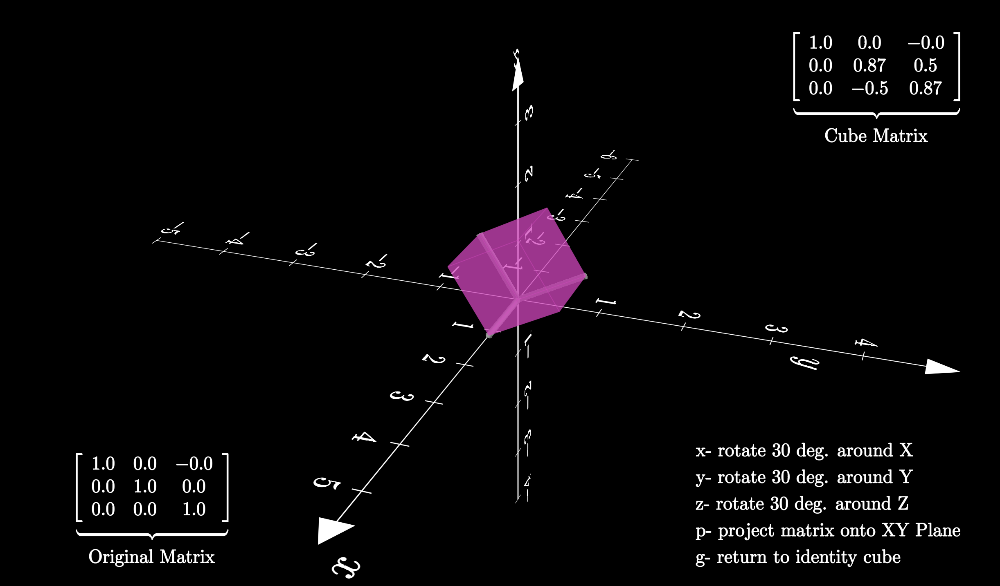
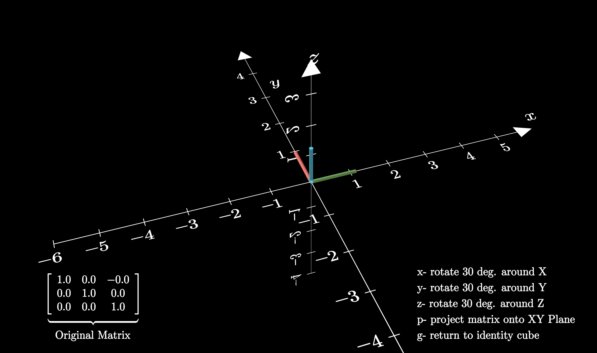

# Matrix Transformation Visualization Suite
Matrix Transformation Visualization Suite is an interactive application designed to help users visualize and understand matrix transformations in a 3D space. Developed with Python and Manim, this project provides an engaging and educational experience to make learning matrix transformations more accessible and enjoyable.

# Features

- Interactive 3D Scene: Displays a unit cube in a 3D environment, allowing users to observe how transformations affect the cube in real-time.

- Multiple Transformation Options: 
Users can apply various transformations to the unit cube, such as rotation and projection, to explore how each operation impacts the object.

- Real-time Display:
As transformations are applied, the transformed cube and its corresponding numerical matrix are updated and displayed in real-time, providing immediate feedback to users.

- Clear Labels and Instructions: 
The application includes clear labels and instructions to guide users through the process of applying transformations, making it easy for individuals of all experience levels to use the software.

- Color-coded Visuals:
The Matrix Transformation Visualization Suite leverages the LaTex library to create a visually appealing interface, with color-coding to enhance user experience and understanding.

# Getting Started

## Getting Started

To get started with the Matrix Transformation Visualization Suite, follow these simple steps:

1. Clone the repository to your local machine.
2. Ensure that you have Python installed.
3. Install the required dependencies using the following commands:
- pip install manim
- pip install numpy
4. Make sure you have the required system dependencies for OpenGL installed. Check the [Manim documentation](https://docs.manim.community/en/stable/installation/dependencies.html) for more information on system dependencies.
5. Run the application using the following command:
- manim -qm -p --renderer=opengl scene.py InteractiveRadius
6. Follow the on-screen instructions to apply transformations to the unit cube and observe the results.

